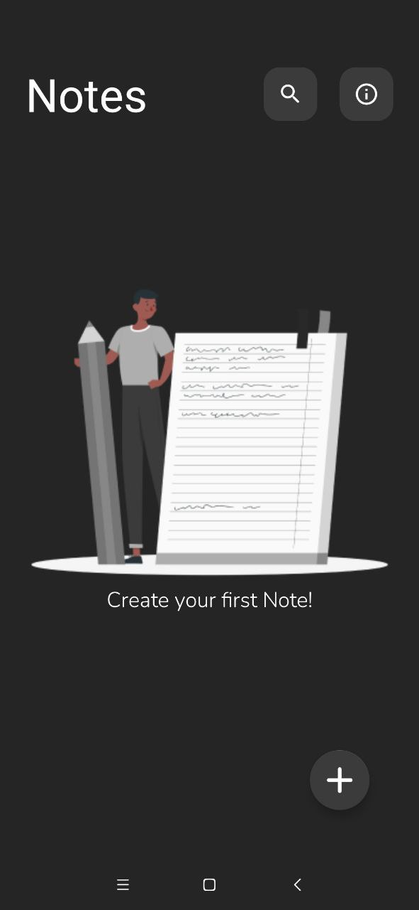
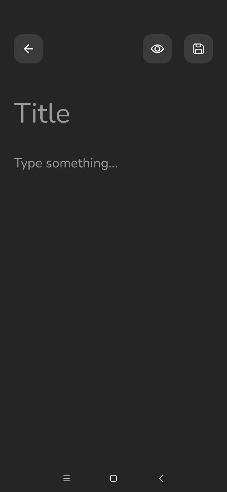
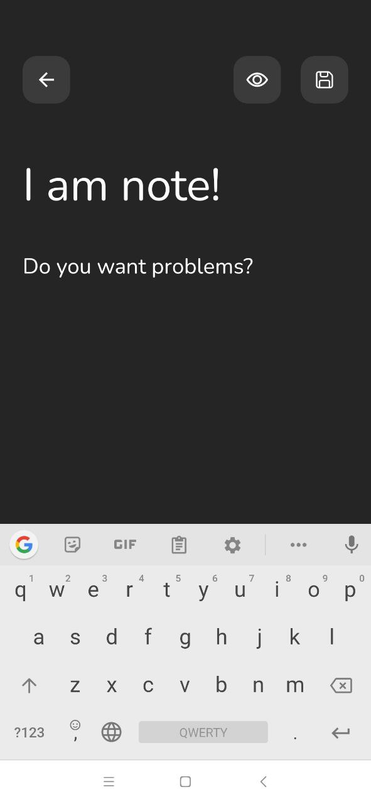
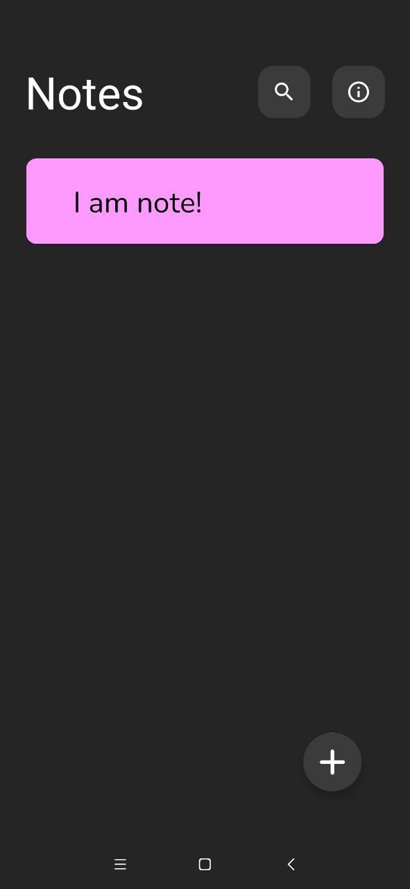
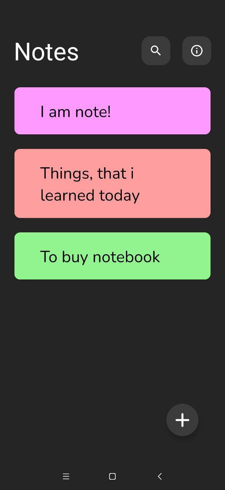
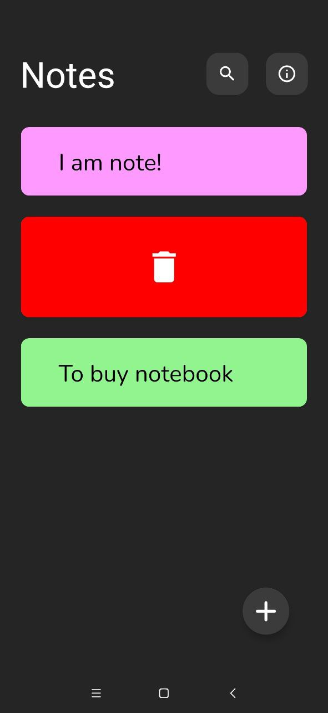
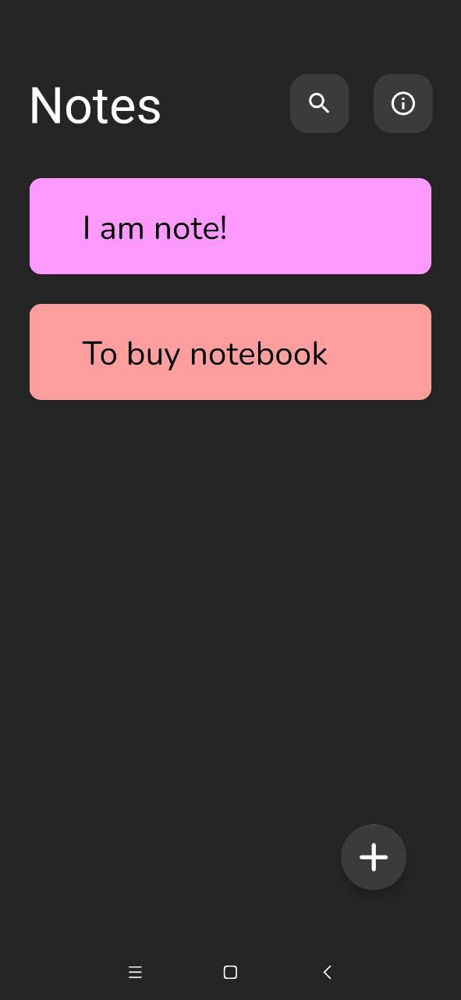

# Notes

### The description will be supplemented as we go along!

MinSDK: 21 (Android 5.0 Lollipop).

Technologies used: MVVM, View Binding, Single Activity App, Kotlin Coroutines, DiffUtil..

Libs used: Navigation, Android Architecture Components, Android Material, Koin (DI)..

  
Screenshots:

  ## Screenshots:

  

  

